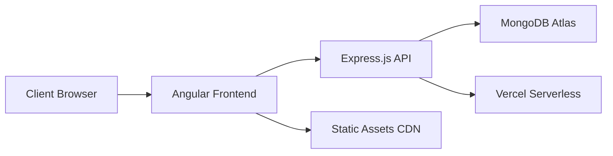
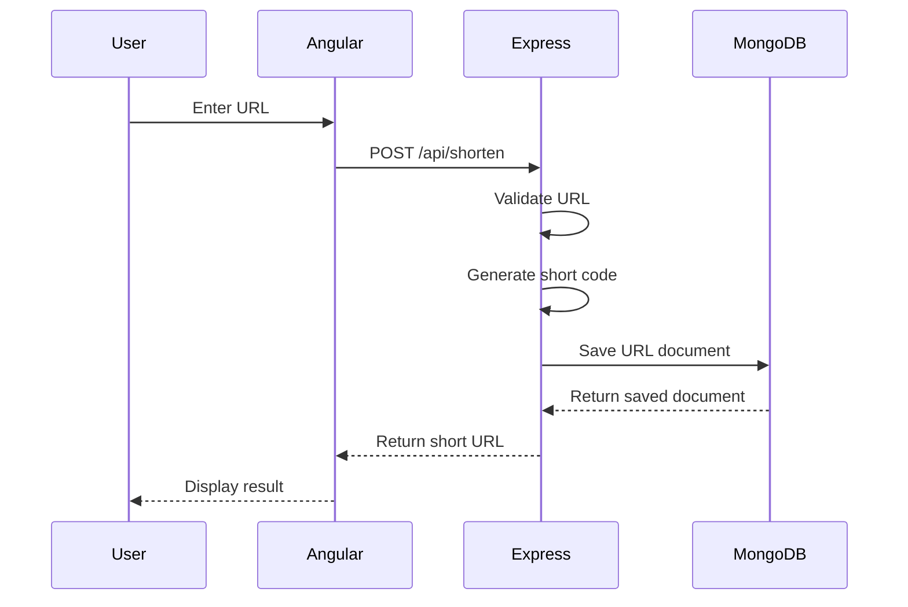
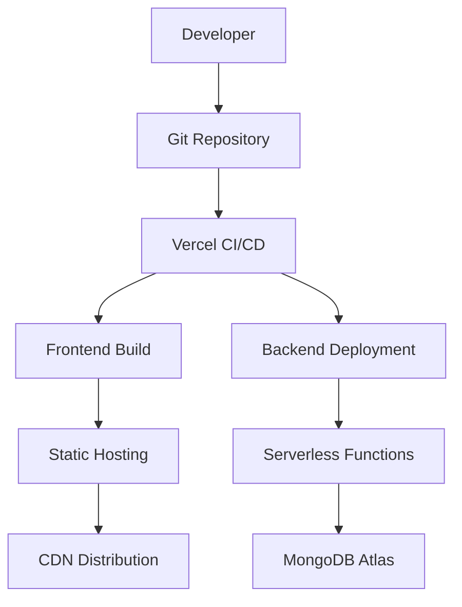
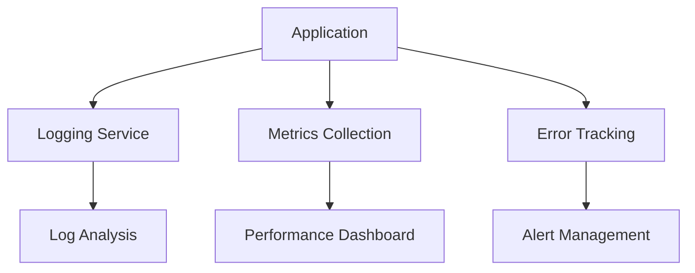
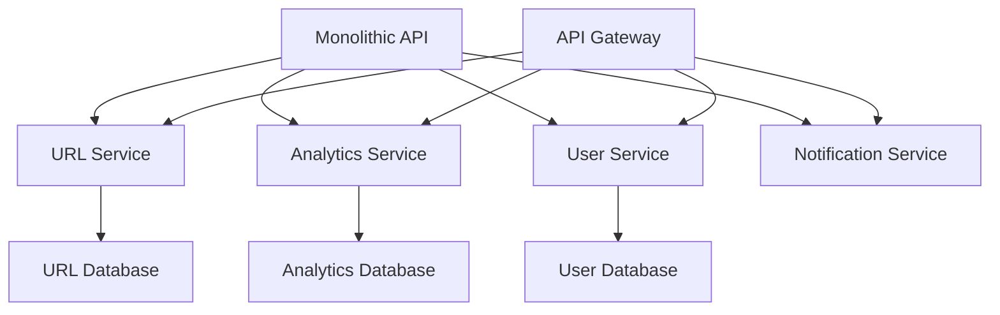
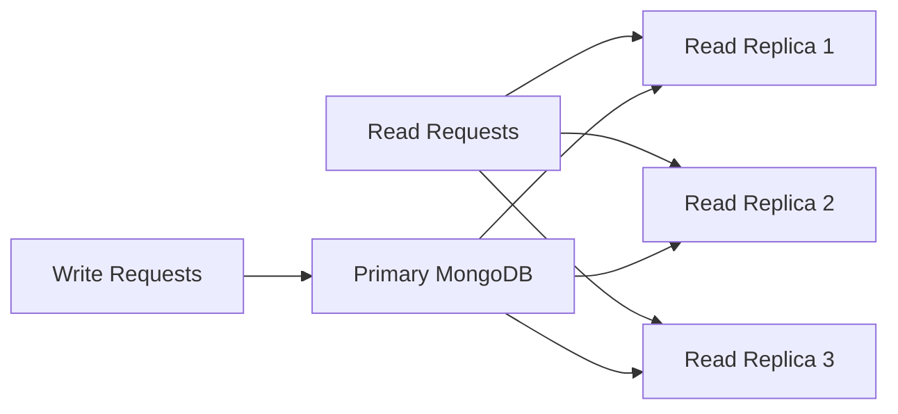
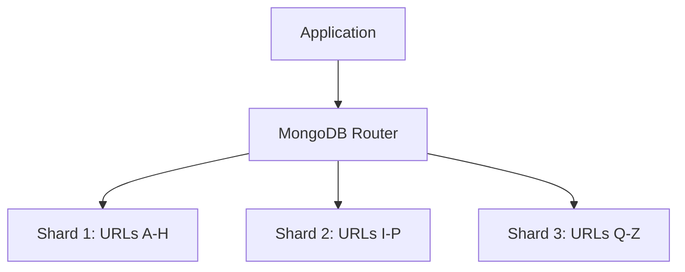

# URL Shortener System Design Architecture

## Overview

This document outlines the system design architecture for a URL shortener application built with Angular 19 frontend, Node.js/Express.js backend, and MongoDB Atlas database.

## Table of Contents

- [High-Level Architecture](#high-level-architecture)
- [Technology Stack](#technology-stack)
- [Component Architecture](#component-architecture)
- [API Design](#api-design)
- [Database Design](#database-design)
- [Core Features](#core-features)
- [Deployment Architecture](#deployment-architecture)
- [Performance Considerations](#performance-considerations)
- [Security & Compliance](#security--compliance)
- [Monitoring & Analytics](#monitoring--analytics)
- [Scalability Roadmap](#scalability-roadmap)

## High-Level Architecture



### Architecture Pattern

- **Pattern**: Client-Server Architecture with RESTful API
- **Deployment**: JAMstack (JavaScript, APIs, Markup)
- **Hosting**: Serverless deployment on Vercel platform

## Technology Stack

### Frontend Stack

| Component | Technology | Version | Purpose |
|-----------|------------|---------|---------|
| Framework | Angular | 19.0.0 | SPA Framework |
| Styling | TailwindCSS | 3.4.15 | Utility-first CSS |
| HTTP Client | Angular HttpClient | Built-in | API Communication |
| State Management | RxJS | 7.8.0 | Reactive Programming |
| Build Tool | Angular CLI | 19.0.1 | Development & Build |

### Backend Stack

| Component | Technology | Version | Purpose |
|-----------|------------|---------|---------|
| Runtime | Node.js | Latest LTS | Server Runtime |
| Framework | Express.js | 4.19.2 | Web Framework |
| Database ODM | Mongoose | 8.5.1 | MongoDB Object Modeling |
| CORS | cors | 2.8.5 | Cross-Origin Resource Sharing |
| Environment | dotenv | 16.4.5 | Environment Variables |

### Database

| Component | Technology | Purpose |
|-----------|------------|---------|
| Database | MongoDB Atlas | Cloud NoSQL Database |
| Connection | Mongoose ODM | Object Document Mapping |
| Hosting | MongoDB Cloud | Managed Database Service |

## Component Architecture

### Frontend Architecture

```tree
src/
├── app/
│   ├── components/
│   │   ├── shared/
│   │   │   └── navbar/              # Navigation component
│   │   └── shorten/                 # URL shortening component
│   ├── services/
│   │   ├── url.service.ts           # API communication service
│   │   └── theme.service.ts         # Theme management service
│   ├── models/
│   │   └── url.model.ts             # TypeScript interfaces
│   └── environments/                # Environment configurations
├── styles.scss                      # Global styles
└── index.html                       # Entry point
```

#### Component Responsibilities

##### Navbar Component

- Application navigation
- Theme switching
- Branding and logo display

##### Shorten Component

- URL input form
- Validation and error handling
- Display shortened URLs
- URL management (view, delete)

##### URL Service

- HTTP API communication
- Error handling
- Response transformation

### Backend Architecture

```tree
backend/
├── index.js                         # Express server entry point
├── controllers/
│   └── urlController.js             # Business logic layer
├── models/
│   └── urlModel.js                  # Database schema definitions
├── routes/
│   └── urlRoutes.js                 # API route definitions
└── vercel.json                      # Deployment configuration
```

#### Layer Responsibilities

##### Route Layer (`urlRoutes.js`)

- HTTP request routing
- Middleware integration
- Request validation

##### Controller Layer (`urlController.js`)

- Business logic implementation
- Data processing
- Response formatting

##### Model Layer (`urlModel.js`)

- Database schema definition
- Data validation rules
- Database interactions

## API Design

### REST API Endpoints

| Method | Endpoint | Description | Request Body | Response |
|--------|----------|-------------|--------------|----------|
| GET | `/` | Health check | None | Welcome message |
| POST | `/api/shorten` | Create short URL | `{originalUrl: string}` | URL object |
| GET | `/api/urls` | Get all URLs | None | Array of URLs |
| GET | `/api/details/:shortUrl` | Get URL details | None | URL object |
| GET | `/api/:shortUrl` | Redirect to original URL | None | HTTP 302 redirect |
| DELETE | `/api/delete/:shortUrl` | Delete URL | None | Success message |

### Request/Response Examples

#### Create Short URL

```http
POST /api/shorten
Content-Type: application/json

{
  "originalUrl": "https://www.example.com/very-long-url"
}
```

```http
HTTP/1.1 200 OK
Content-Type: application/json

{
  "_id": "60f7b3b3b3b3b3b3b3b3b3b3",
  "originalUrl": "https://www.example.com/very-long-url",
  "shortUrl": "Ab3Xy",
  "clicks": 0,
  "expirationDate": "2025-06-20T12:00:00.000Z",
  "createdAt": "2025-06-13T12:00:00.000Z"
}
```

### Data Flow Diagram



## Database Design

### URL Collection Schema

```javascript
{
  _id: ObjectId,                    // MongoDB auto-generated ID
  originalUrl: String,              // Original long URL (required)
  shortUrl: String,                 // Generated short code (required, unique)
  clicks: Number,                   // Click counter (default: 0)
  expirationDate: Date,             // Auto-expiry date (7 days from creation)
  createdAt: Date                   // Creation timestamp (default: now)
}
```

### Database Indexes

```javascript
// Unique index on shortUrl for fast lookups and uniqueness
{ shortUrl: 1 }, { unique: true }

// Compound index for expiration cleanup
{ expirationDate: 1, createdAt: 1 }

// Index on originalUrl for duplicate detection
{ originalUrl: 1 }
```

### Database Features

#### Automatic Expiration

- TTL (Time To Live) index on `expirationDate`
- Automatic document removal after 7 days
- Prevents database bloat

#### Validation Rules

- URL format validation using regex
- Required field enforcement
- Unique constraint on short codes

#### Performance Optimization

- Strategic indexing for fast queries
- Connection pooling with Mongoose
- Query optimization for analytics

## Core Features

### URL Shortening Algorithm

```javascript
function generateUniqueId(length = 5) {
  const characters = 'ABCDEFGHIJKLMNOPQRSTUVWXYZabcdefghijklmnopqrstuvwxyz0123456789';
  let result = '';
  for (let i = 0; i < length; i++) {
    const randomIndex = Math.floor(Math.random() * characters.length);
    result += characters[randomIndex];
  }
  return result;
}
```

**Algorithm Characteristics:**

- **Character Set**: 62 characters (A-Z, a-z, 0-9)
- **Code Length**: 5 characters
- **Total Combinations**: 62^5 = 916,132,832 possible codes
- **Collision Handling**: Database unique constraint with retry logic

### URL Validation

```javascript
const urlRegex = /^(http|https):\/\/[^ "]+$/;
```

**Validation Features:**

- Protocol enforcement (HTTP/HTTPS)
- Basic format validation
- XSS prevention
- Malformed URL rejection

### Click Tracking

```javascript
// Increment click counter on each redirect
url.clicks++;
await url.save();
```

**Analytics Features:**

- Real-time click counting
- Historical data retention
- Performance metrics collection

## Deployment Architecture

### Current Deployment Stack



### Environment Configuration

#### Development Environment

```typescript
export const environment = {
  production: false,
  apiUrl: 'http://localhost:3000/api'
};
```

#### Production Environment

```typescript
export const environment = {
  production: true,
  apiUrl: 'https://url-shortener-app-nrnh.vercel.app/api'
};
```

### Deployment Features

#### Frontend Deployment

- Static site generation
- Automatic HTTPS
- Global CDN distribution
- Atomic deployments

#### Backend Deployment

- Serverless functions
- Auto-scaling
- Environment variable management
- Automatic SSL certificates

## Performance Considerations

### Current Performance Profile

| Metric | Value | Target |
|--------|-------|---------|
| API Response Time | 200-500ms | <200ms |
| Page Load Time | 1-2s | <1s |
| Database Query Time | 50-100ms | <50ms |
| CDN Cache Hit Rate | 95% | >98% |

### Optimization Strategies

#### Frontend Optimization

- Code splitting with Angular modules
- Lazy loading for components
- Image optimization and compression
- Service worker for caching

#### Backend Optimization

- MongoDB connection pooling
- Query optimization with proper indexing
- Response compression
- API response caching

#### Database Optimization

- Strategic indexing for common queries
- Connection pooling configuration
- Query performance monitoring
- Data archiving for old URLs

### Recommended Improvements

1. **Caching Layer**

   ```mermaid
   graph LR
     A[Client] --> B[CDN]
     B --> C[Redis Cache]
     C --> D[Express API]
     D --> E[MongoDB]
   ```

2. **Database Sharding**
   - Horizontal partitioning by URL creation date
   - Geographic distribution for reduced latency

3. **Load Balancing**
   - Multiple serverless function instances
   - Request distribution optimization

## Security & Compliance

### Current Security Measures

#### Input Validation

```javascript
// URL format validation
const urlRegex = /^(http|https):\/\/[^ "]+$/;
if (!urlRegex.test(originalUrl)) {
  return res.status(400).json('Invalid URL');
}
```

#### CORS Configuration

```javascript
app.use(cors({
  origin: "*", // Note: Should be restricted in production
}));
```

### Security Recommendations

#### Authentication & Authorization

- JWT-based authentication for admin features
- Role-based access control
- API key management for enterprise users

#### Input Sanitization

- XSS prevention
- SQL injection protection
- URL validation enhancement

#### Rate Limiting

```javascript
const rateLimit = require('express-rate-limit');

const limiter = rateLimit({
  windowMs: 15 * 60 * 1000, // 15 minutes
  max: 100 // limit each IP to 100 requests per windowMs
});

app.use('/api', limiter);
```

#### Security Headers

```javascript
app.use((req, res, next) => {
  res.setHeader('X-Content-Type-Options', 'nosniff');
  res.setHeader('X-Frame-Options', 'DENY');
  res.setHeader('X-XSS-Protection', '1; mode=block');
  next();
});
```

### Compliance Considerations

#### Data Privacy

- GDPR compliance for EU users
- Data retention policies
- User consent management

#### Security Standards

- HTTPS enforcement
- Regular security audits
- Vulnerability scanning

## Monitoring & Analytics

### Current Metrics

#### Application Metrics

- URL creation rate
- Click-through rates
- Error rates and response times
- Database performance metrics

#### Business Metrics

- Total URLs created
- Total clicks tracked
- Popular domains
- Usage patterns

### Recommended Monitoring Stack



#### Monitoring Tools

- **Application Performance**: New Relic, DataDog
- **Error Tracking**: Sentry, Rollbar
- **Logging**: Winston, Morgan
- **Analytics**: Google Analytics, Mixpanel

### Custom Analytics Implementation

```javascript
// Enhanced click tracking
const trackClick = async (shortUrl, req) => {
  const url = await Url.findOne({ shortUrl });
  
  // Track additional metrics
  const analytics = {
    timestamp: new Date(),
    userAgent: req.headers['user-agent'],
    referrer: req.headers.referer,
    ip: req.ip,
    shortUrl: shortUrl
  };
  
  // Store analytics data
  await AnalyticsModel.create(analytics);
  
  // Update click counter
  url.clicks++;
  await url.save();
};
```

## Scalability Roadmap

### Phase 1: Current State (MVP)

#### Features

- Basic URL shortening and redirection
- Simple click tracking
- 7-day URL expiration
- MongoDB storage

#### Capacity

- ~1M URLs per month
- ~10M redirects per month
- Single region deployment

### Phase 2: Enhanced Features (3-6 months)

#### New Features

- User authentication and personal dashboards
- Custom short codes
- Advanced analytics dashboard
- QR code generation
- Bulk URL operations

#### Technical Improvements

- Redis caching layer
- API rate limiting
- Enhanced security measures
- Performance monitoring

#### Enhanced Capacity

- ~10M URLs per month
- ~100M redirects per month
- Multi-region CDN

### Phase 3: Enterprise Scale (6-12 months)

#### Enterprise Features

- White-label solutions
- API access for enterprise customers
- Advanced analytics and reporting
- Integration webhooks
- Custom domain support

#### Architecture Changes

- Microservices architecture
- Event-driven processing
- Database sharding
- Multi-region deployment

#### Enterprise Capacity

- ~100M URLs per month
- ~1B redirects per month
- Global deployment

### Microservices Migration Plan



#### Service Breakdown

- **URL Service**: Core shortening and redirection
- **Analytics Service**: Click tracking and reporting
- **User Service**: Authentication and user management
- **Notification Service**: Email and webhook notifications

### Database Scaling Strategy

#### Read Replicas



#### Sharding Strategy



## Conclusion

This system design provides a comprehensive architecture for a scalable URL shortener application. The current implementation supports the MVP requirements while laying the foundation for future enhancements and scale.

### Key Strengths

- Modern, maintainable technology stack
- Serverless deployment for cost efficiency
- Clear separation of concerns
- Built-in security and validation
- Comprehensive monitoring capabilities

### Growth Path

The architecture is designed to evolve from a simple URL shortener to a comprehensive link management platform, supporting enterprise use cases and global scale.

### Next Steps

1. Implement caching layer for improved performance
2. Add comprehensive monitoring and analytics
3. Enhance security with rate limiting and authentication
4. Plan for microservices migration as scale demands

---

*This document should be reviewed and updated as the system evolves and new requirements emerge.*
